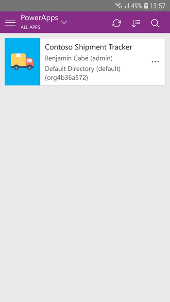

# IoT Lab: How to increase revenue by harnessing IoT data in digital transformation solutions <!-- omit in toc -->

## Introduction and Scenario <!-- omit in toc -->

Contoso Art Shipping Inc. is a company specialized in shipping artwork. They are losing money as their customers are generally dissatisfied with their service – more and more parcel are getting damaged due to adverse weather conditions and improper handling, which causing a tremendous increase in insurance claims, as well as associated personnel costs to follow up on said claims.

Contoso already have an ERP in place and they have built a mobile application that allows to show “basic” tracking information, essentially parcel pick-up date and estimated delivery date.

They realize they need to be more precise on the location of the parcels, conditions during travel, and their overall ability to detect that goods are getting tampered during transport – they ship ~50,000 shipments a month with the issues mentioned above costing them an estimated \$2 per shipment on average, i.e over \$1M every year.

## Pre-requisites <!-- omit in toc -->

If you are going through this lab, you are probably attending our [Immersive session](https://myinspire.microsoft.com/sessions/34136301-fa4d-4ada-b369-9f6acaebcbb4) at Microsoft Inspire 2019, in which case you're already set with all the pre-requisites! In fact, if you're interested in learning more about what's behind the scenes, you should [check out the setup instructions](lab-setup) as it will help you understand better the technical concepts behind each aspect of the solution. 

In a nutshell, here are all the things that have already been [prepared](/lab-setup) for you ahead of this lab:

* Azure subscription with an associated Azure Active Directory for your Contoso Art Shipping company ;
* User account in this Azure Active Directory for you to log into the different services and applications you will be using. The credentials for this user account should have been provided to you at the beginning of the lab ;
* [Azure IoT Central](https://azure.microsoft.com/en-us/services/iot-central/) application ;
* Azure IoT PnP-ready, [Arduino](https://www.arduino.cc/)-based, cellular asset tracking device ;
* [Arm Pelion](https://www.arm.com/products/iot/pelion-iot-platform/connectivity-management/connectivity-as-a-service) SIM card ;
* [PowerApps](https://powerapps.microsoft.com) subscription, linked to your user account.

## Outline <!-- omit in toc -->

In this lab, we will be going through the key components of Contoso Art Shipping's IoT solution.

* [1. A quick look at IoT Central](#1-A-quick-look-at-IoT-Central)
* [2. Logging shipment incidents into Common Data Service](#2-Logging-shipment-incidents-into-Common-Data-Service)
* [3. Enabling SIM cards in Arm Pelion portal](#3-Enabling-SIM-cards-in-Arm-Pelion-portal)
* [4. Testing Contoso's refreshed PowerApp](#4-Testing-Contosos-refreshed-PowerApp)
* [5. Going further](#5-Going-further)

## 1. A quick look at IoT Central

Go to <https://apps.azureiotcentral.com/> and use the credentials provided to you by your trainer to sign in.

As your trainer walks through the IoT Central user interface, you can follow along and explore the various sections by yourself, in particular you may want to:

* Navigate to "Device Templates / Asset Tracker", and explore the various capabilities of the asset tracking device.
* Navigate to "Device Explorer" and select one of the devices from the list. From there, you can get familiar with the visualization capabilities of IoT Central.
* Navigate to "Device Sets" and create your own device set (try to come up with a name that will be unique, as your fellow Contoso "colleagues" are going through the same steps!), then create a dashboard (follow the lead of your trainer, who is also going to be building one).

## 2. Logging shipment incidents into Common Data Service

Contoso's tracking devices have the ability to generate a *tampered* event, when someone presses the alert light icon on the touch screen. We are going to have a look at the rule already setup in our IoT Central template. 

From the "Rules" tab of the device template, navigate to the "onTampered" rule.

As highlighted before, notice that the logic here is pretty simple: "IF tampered event occurs THEN trigger an MS Flow". Of course, rules can be more complex and you could for example implement a rule that looks at the average temperature over the past 30 minutes and fire if it's above a threshold.

You can click on "Microsoft Flow" in the "Actions" list to have a closer look at what the Flow does. In a nutshell, the MS flow makes a query to CDS to find which shipment is associated to the tracker that got tampered, and then log a new incident for it (i.e create a new CDS "Incident" record).

## 3. Enabling SIM cards in Arm Pelion portal

This step will be performed by your trainer. They are the person at Contoso who have been ordering the Arm Pelion SIM cards and who have access to the management portal. 

## 4. Testing Contoso's refreshed PowerApp

At this stage, we have gone through the following steps:

* Deploy an IoT Central application.
* Configure IoT Central: customize theme, import/declare the asset tracking device's capability model, configure device sets and associated dashboards.
* Define an IoT Central rule that triggers an MS Flow that feeds data into CDS (i.e logs incidents associated to shipments).
* Enrich Contoso's legacy PowerApp using WYSIWYG ("What you see is what you get") online studio, and display information related to incidents.
* Publish Contoso's PowerApp to allow Contoso employees (you!) to use it.

In fact, it is now time for you to test this refreshed PowerApp, and to see how it interacts with your asset tracker that is now fully connected to IoT Central.

1. Download PowerApps on your mobile phone.
   * Apple App Store: <https://aka.ms/powerappsios>
   * Google Play: <https://aka.ms/powerappsandroid)>

1. Open PowerApps and use the credentials provided to you by your trainer to sign in.  

1. Select “Go to all Apps to get started”, and open “Contoso Shipment Tracker”.  

1. Grant camera (the app contains a QR code scanner that will use your phone’s camera) and Common Data Service permissions.  

1. Click the “QR Scan” button in the shipments’ search bar, and scan your asset tracker’s QR code.  

1. Open the details of the shipment, and notice that you are able to visualize the list of incidents.

1. Press the red alert icon on the touch screen, and notice how a few seconds later your PowerApp displays the incident.

1. Click on the incident to dig deeper into it, you should see a new screen with more information such as for example the location of the shipment when it has been tampered with.

## 5. Going further

Although we've implemented a fully functional solution, there are a few things that could be improved or done differently, and that you may want to keep in mind if you are interested in going further:

* Implement rules based on telemetry, such as "IF average temperature > 30C for 10min THEN send an email"
* Leverage [Flow Approvals](https://docs.microsoft.com/en-us/connectors/approvals/) or [Dynamics 365](https://dynamics.microsoft.com/en-us/) to implement custom workflows that involve e.g the driver's manager, or the recipient of the shipment, to determine a course of action should a shipment be tampered with.
* Use the "Telemetry send interval" setting of the asset tracking device to fine tune how often the device reports the temperature, humidity etc., as this can have a direct impact on the battery life.
