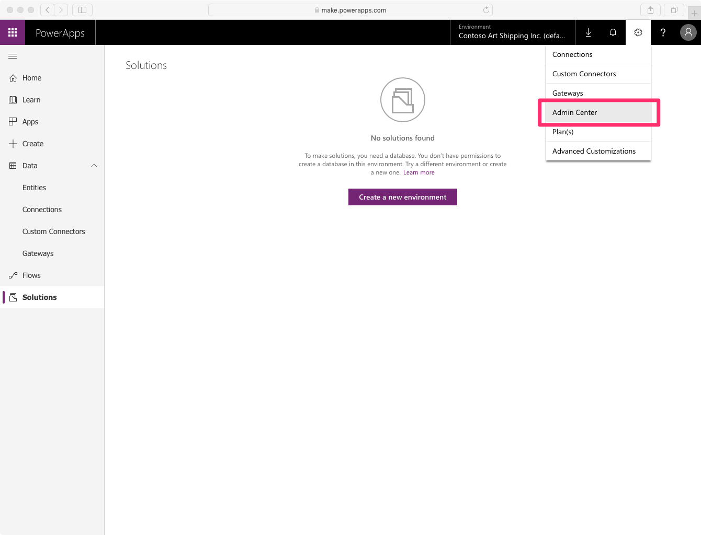
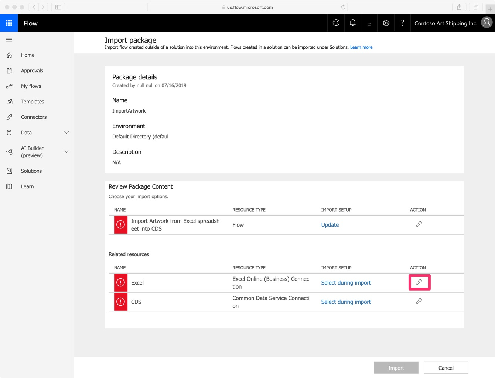

# How to set up "How to increase revenue by harnessing IoT data in digital transformation solutions" lab

This lab features lots of visual demonstrations and interactions with its various components (wireless IoT device, IoT Central portal, PowerApps mobile application) and is aimed at people interested in getting an overview of Microsoft and its IoT partner ecosystem's offering, using a logistics / track & trace use case as an example. It is *not* aimed at developers, and a typical audience is line-of-business managers, executives, or sales professional.

However, if you are reading this you are interested in setting up the lab for your own audience. Rest assured that in doing that you will learn a lot about *how* to build a logistics / asset tracking solution, where your participants will be focusing on *what* needs to be done, and *why*.

The preparation for this lab is split into four different parts:

1. [Cloning this repository](#1-Cloning-this-repository) ;
2. [Setting up Azure tenant, subscription, and resources (IoT Central)](#2-Setting-up-your-Azure-environment) ;
3. [Sourcing, assembling, and flashing the IoT devices](#3-Preparing-the-Hardware) ;
4. [Setting up PowerApps subscription and solution](#4-Setting-up-your-PowerApps-environment) ;
5. [Finalizing IoT Central setup](#5-Finalizing-IoT-Central-setup).

## 1. Cloning this repository

As this Github repository contains some useful scripts and resources that you will be using to help you setup the lab, you should start by cloning this repository on your machine

```bash
git clone https://github.com/kartben/Inspire-E2E-IoT-Workshop
```

## 2. Setting up your Azure environment

It is recommended that you create a dedicated Azure tenant for the workshop. This allows to create an environment that doesn't require your students to come with an existing Azure and PowerApps subscription, and more importantly it makes it easier to tell a .

### ➔ Creating an Azure Active Directory tenant

In this step, you are going to create a brand new Azure tenant that will eventually host all the resources (mainly an Azure IoT central application) and user accounts for our fictional company Contoso Art Shipping. You will be using your existing Azure credentials and will setup a new Azure Active Directory tenant, with its own subscription, that will be used for hosting your users and cloud resources.

1. Log into the [Azure Portal](https://portal.azure.com/) using your credentials. Reminder: you need to be setup as the Owner of the existing subscription you plan on using for your new tenant. If that is not the case please use Option 2 below.

1. Open the "Azure Active Directory" (AAD) blade, and select "Create a Directory".  


1. In the "Create directory" form, type the following information:
   * **Organization name**: Contoso Art Shipping Inc.
   * **Initial domain name**: contosoartshippinginc (Note: initial domain names are globally unique, so you will probably need to use variants of "contosoartshipping", such as "contosoartshipping-lab" or "contosoartshipping-2019")
   * **Country or region**: this determines the data center for your AAD directory, pick your preferred country/region.  


1. Once the form is complete, select the "Create" button.

1. The creation of the directory may take a few minutes. When the creation is completed, follow the link that invites you to manage your new directory.  


1. Notice that you while you are still logged in with the same principal you used earlier, you are now in your newly created AAD directory (see screen capture below).  


### Create a new subscription

1. Navigate to the "Cost Management + Billing" blade, and select "New subscription".  


1. If you never signed up for a Free Trial, apply for it and follow the instructions. If you've already benefited from a Free Trial, you will want to proceed with setting up a Pay-as-You-Go subscription.  


1. Once your subscription has been created, you should see it in "My subscriptions" in the Cost Management center.  


### Creating user accounts for your lab participants

Note: If you don't already have the Azure command-line interface on your machine, install it by [following these instructions](https://docs.microsoft.com/en-us/cli/azure/install-azure-cli?view=azure-cli-latest).

In this step, you are going to create accounts in the form of `user001@yourdomain.com` for the participants to your lab.

1. Open a terminal session and log into your newly created Azure tenant using ```az login```

2. Execute the script `./lab-setup/scripts/createUsers.sh [domain] [password] [nbAccounts]`.
   * Replace `[domain]` by your directory's domain name, ex. contosoartshipping-2019.onmicrosoft.com
   * Replace `[password]` by the password you'd like to set for the users, ex. P@ssword
   * Replace `[nbAccounts]` by the number of users you'd like to create, ex. 100

### Setting up an Azure IoT Central application

Next, you're going to setup the Azure IoT Central application that is going to be used by Contoso Art Shipping to connect their asset trackers to, allow them to monitor their fleet in real-time and, more importantly, provide them with a way to feed the data and extracted insights (e.g "Shipment XYZ has been tampered!") into their .

In order to bootstrap the IoT Central application quickly, you will be using an existing application template.

1. Open <https://apps.azureiotcentral.com/create?appTemplate=fd94d78e-3963-4768-94f8-8efbcc5fe5e5> in your browser

2. In the "Create an application" form, enter the following information:
   * **Choose a payment plan**: *Pay-As-You-Go*.
   * **Application Name**: *Contoso Art Shipping*.
   * **URL**: *contoso-art-shipping-XYZ* (XYZ being a unique suffix of your liking, as IoT Central application URLs should be globally unique).
   * **Directory**: select the Azure AD you have created [earlier](#Creating-an-Azure-Active-Directory-tenant).
   * **Azure subscription**: select the Azure subscription you have created for your Azure AD.
   * **Region**: select the region closest to where you expect your users/devices to be.  


1. Submit the form by clicking on "Create", and wait a few seconds for your application to be created.

1. Navigate to the Administration / Users page.

2. By clicking on "Add user", grant access to your lab participants by adding their email (e.g `user001@domain.com`) and giving them the "Application Operator" role.

3. Navigate to the Administration / Device Connection page, and note the "Scope ID" and the "Primary Key" values, as you will need this information when preparing the asset tracking devices.  


1. Finally, navigate to the "Device Explorer", and note the "Template ID" for the Asset Tracker template.  


## 3. Preparing the Hardware

The device used in this lab is built with the [Arduino platform](https://www.arduino.cc/), an open-source electronics platform based on easy-to-use hardware and software. You will need to acquire the equipment listed below in order to prepare the kits for your participants.

> Note: depending on your geographical location, you may want to use other suppliers than the ones listed below as examples.

### Bill of Materials

#### [Arduino MKR GSM 1400](https://store.arduino.cc/usa/mkr-gsm-1400)

* Retail price: USD 69.90
* Buy from: [Arduino Store](https://store.arduino.cc/usa/mkr-gsm-1400), [Mouser](https://www2.mouser.com/ProductDetail/Arduino/ABX00018?qs=%2Fha2pyFaduhmYvnoJVWU32W04%2F60eHEJ%252B94cFnN%252BkXI=)
  * For small quantities, you may want to consider getting your MKR GSM with a SIM card directly from Arduino (in partnership with [Arm Pelion](https://www.arm.com/products/iot/pelion-iot-platform/connectivity-management/connectivity-as-a-service)), [here](https://store.arduino.cc/usa/sim) (USD 70.90).
  
> Note: you will want to check that your MKR GSM board comes with a GSM antenna.


#### [Arduino MKR ENV Shield](https://store.arduino.cc/usa/mkr-env-shield)

* Retail price: USD 34.40
* Buy from: [Arduino Store](https://store.arduino.cc/usa/mkr-env-shield), [Mouser](https://www2.mouser.com/ProductDetail/Arduino/ASX00011?qs=%2Fha2pyFaduihW07lKAnjJGztgJ19Y1I%2Fl9R2%2FAgQnsRhOqKdbbnOcw%3D%3D)


#### [Touchscreen enclosure for Arduino MKR](https://www.hwhardsoft.de/english/projects/arduitouch-mkr/)

* Retail price: EUR 60
* Buy from: [Zihatec](https://www.hwhardsoft.de/english/webshop/arduitouch/#cc-m-product-11543776297)


#### Arm Pelion SIM card

As mentioned before, for small amount of participants (less than 12), you should consider getting Arduino MKR GSM 1400 with SIM cards directly from Arduino. For larger quantities, it is recommended you directly [contact Arm](https://www.arm.com/products/iot/pelion-iot-platform/connectivity-management/talk-with-an-expert).

### Flashing your Arduino MKR1400 GSM

Follow the instructions at <https://github.com/kartben/contoso_asset_tracker> in order to flash the proper IoT Central firmware into your Arduino device.

As of July 2019, the provisioning of the device is performed using group keys, therefore make sure to update the config files with the proper values for [connecting to IoT Central](https://github.com/kartben/contoso_asset_tracker#iot-central), i.e configure the scope ID, group key, and modelID that you've retrieved when [setting up](#Setting-up-an-Azure-IoT-Central-application) the IoT Central application.

> Note: In a future version of this lab, the provisioning of the device will be performed using the X.509 certificates contained in the Arm Pelion SIM cards, and the device will be exposing its capabilities using Plug-and-Play. Provisioning will then be truly zero touch, as the Arduino firmware will be completely generic, and the only bootstrapping step required for the devices will be to set the scope ID, which can be done over e.g. SMS.

### Assembling the parts

1. Gather the following parts: Arduitouch, MKR1400 GSM, MKRENV Shield, GSM Antenna, SIM Card.  


1. Insert the Micro SIM card into the MKR1400 GSM  


1. Insert the MKR1400 GSM and MKRENV shield into their dedicated slots. You might need to force slightly.  
 

1. Plug the GSM antenna into the dedicated connector on the MKR1400 GSM.  


1. You can now close your Arduitouch enclosure! You should be able to slip the antenna through one of the wider slits of the back panel as you are doing so.  


## 4. Setting up your PowerApps environment

In this section, you are going to setup your PowerApps environment. You're going to setup PowerApps trial accounts for all your participants, and you will be deploying a PowerApps solution template that already contains an app and some Common Data Service (CDS) entities for managing the shipments, their incidents, etc.

During the lab, your participants will get to see an overview of how one to create a PowerApp, how to extend CDS with custom entities, and finally how to manipulate CDS entities from MS Flow rules triggered by IoT Central (e.g log a new incident for a shipment on reception of the event "shipmentTampered").

1. Open admin.microsoft.com in your web browser, and sign in as 'admin' if prompted.  


1. Navigate to the "Users" section. The list of active users should contain all the users you've created earlier.


1. Navigate to "Billing / Purchase services", and in the search field enter "powerapps".


1. Select "Microsoft PowerApps Plan 2"  

1. Select "Get free trial"  


1. Confirm your order by clicking "Try now".  


1. You should be getting a confirmation shortly. Click on "Users" to go back to the Users page where you will need to assign your Contoso users the newly created trial subscriptions.  


1. On the Active Users page, select all your users, then open the "..." menu. Then, click on "Manage product licenses".  


1. Select "Replace existing product license assignments", then click "Next".  


1. Select "Microsoft PowerApps Plan 2", then click "Replace"  


1. The PowerApps 2 licenses should have been correctly assigned, you can now click "Close".  


### Provisioning the Common Data Service database

As Contoso is building their solution on top of CDS, you need to initialize a database in your default environment.

1. Open <https://powerapps.com> in your web browser, and sign in as 'admin' if prompted. You will be taken to the PowerApps homepage.  


1. Open "Admin Center" from the navigation bar. It will open in a new tab.  


1. Select the "Contoso Art Shipping Inc." environment.  


1. Select "Create my Database" to initiate the creation of the Common Data Service database. In the popup that opens, select "USD" as "Currency" and "English" as "Language".  


1. Provisioning the database will take 3-5 minutes. When provisioning is complete, the "Provisioning database..." popup will automatically disappear.  


1. Close the browser tab and go back to the previous tab where powerapps.com is open.

### Importing Contoso's solution (PowerApp & CDS entities)

In this step, you are going to import an existing PowerApps solution into your environment. 

1. Now that you are back on the powerapps.com homepage, select the Solutions tab and click on "Import".  


1. In the popup that open, click on "Choose file", select the `ContosoAssetTracking_1_0_2_4.zip` from the `lab-setup/powerapps/` folder of the cloned Git repository of the lab, then click "Next".  


1. Confirm that you want to proceed with the import by clicking "Import"  


1. The import process will take a few minutes. A popup will keep you informed of the progression.  


1. When the import is complete, dismiss the popup by clicking "Close".  


1. Let's now have a quick look at what has been imported. For this, select "Contoso Asset Tracking" and click "Edit".  


1. Notice that your solution is made up of three components:
   * "Contoso Shipment Tracker": the [Canvas App](https://docs.microsoft.com/en-us/powerapps/maker/canvas-apps/getting-started) that allows to browse shipments and their associated incidents.
   * "Incident": CDS entity that models incidents. An incident is attached to a given shipment, has a cause, and can also capture information about the geographical position.
   * "Shipment": CDS entitiy that models shipments. A shipment has a shipping date, a delivery date, a photo, and is of course uniquely identified.  


1. Select the "Contoso Shipment Tracker" Canvas App and click "Play".  


1. As this is the first time you are launching the app, you need to grant access to 1/ your CDS entities 2/ your camera (the application features a barcode scanner, and although you can't use it in the web version of the application, permission is listed nevertheless).  


1. The application should now be loading without any error. And yes, it doesn't show any shipment just yet, as you are going to create them in a moment!


### Adding new shipments into CDS

In this step, you are going to use an Excel file that has all the information about the shipments to populate the CDS `Shipment` table. You will be leveraging MS Flow support for both Excel Online and CDS to easily convert our Excel file into new entries in the `Shipment` table. 

1. Open the `contoso-artwork.xlsx` file you will find in the current folder in Excel. Adjust the number of rows to reflect the number of users you have setup in the Contoso company (i.e. the number of attendees to your lab), and update the `trackerID` column with the ICCIDs of the SIM cards you have sourced for the lab and put in the MKR1400 devices.

1. Move the Excel file over to your personal OneDrive folder so that you can access it from MS Flow in the following steps

1. Open <https://flow.microsoft.com> in your web browser, and sign in as 'admin' if prompted. You will be taken to the PowerApps homepage.  


1. Go to "My Flow", and select "Import".

1. Select `import-contoso-artwork-msflow.zip` and click "Import". Wait for the import to complete.


1. In the 'Related Resources' section, you need to make sure to associate the "Excel" connection with your personal account (where you have stored the Excel file) by clicking on the tool icon.


1. Select "New Connection" and enter "excel" in the search field. In the now filtered list of connections, select "Excel Online (business)".


1. Click "Create" and finalize the connection to the account where you've stored the Excel file.


1. Back in the import package screen, select the "tool" icon in front of the CDS connection and make sure and bind the flow to the existing connection that shows up.


1. Click "Import" to finalize the import.

1. As you get confirmation the "All package resources were successfully imported", click "Open flow".


1. In the "List rows present in a table" section of the flow, update the "File" attribute to reflect the location of the Excel file in your OneDrive. Click on the folder icon to navigate through your OneDrive folders and select the file.


1. Save the flow, and go back to the previous screen.


1. Run the flow!


Over the next couple minutes, the flow will go through the following steps (you can go back to editing the flow to have a closer look at how each of them is implemented, if you're interested), before reporting it successfully completed:

* Delete any existing Shipment in CDS by iterating over every existing record
* Enumerate all the rows in the Excel file and, for each:
  * Download the thumbnail for the painting which URL is stored in the `picture` column
  * Create a new `Shipment` entry in CDS, using the values found in the row as well as the picture that was just downloaded to populate its various field.

### Publishing the application

The last step will now be to make sure our PowerApps is available to all the members of your Contoso organization, by publishing it.

1. Open <https://make.powerapps.com> and edit the "Contoso Shipment Tracker" application (from the list of recent apps, open the "..." contextual menu to find the "Edit" command).

1. Confirm that your application now lists the shipments on its home screen.

1. Open the "File" menu of the PowerApps editor (don't confuse it with the file menu of your browser! ;-)), and click "Publish" 

## 5. Finalizing IoT Central setup

XXX
